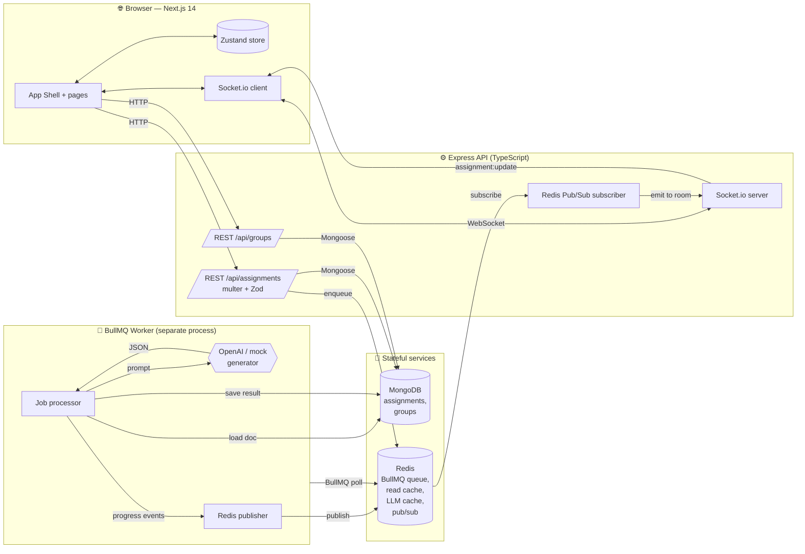
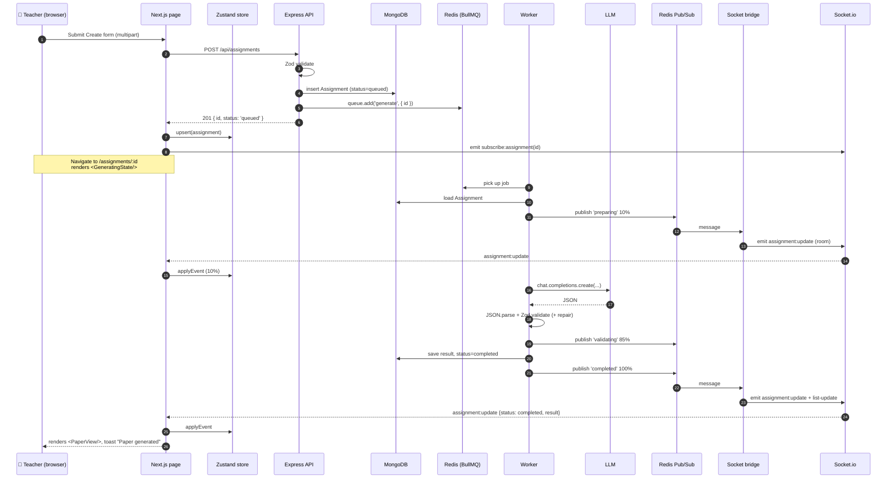
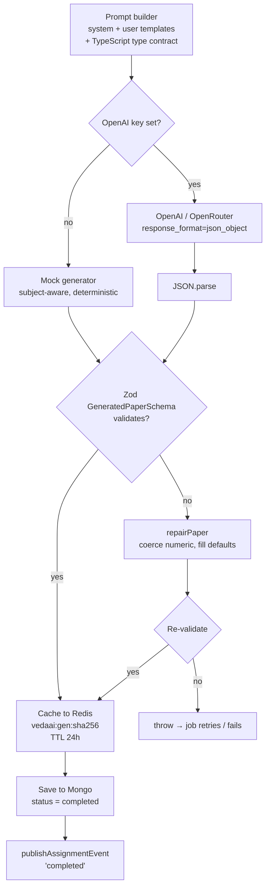
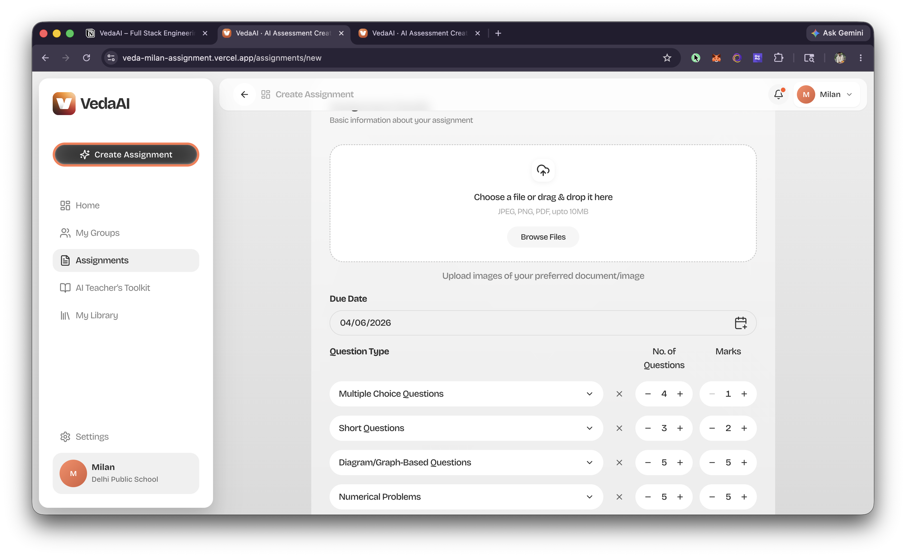
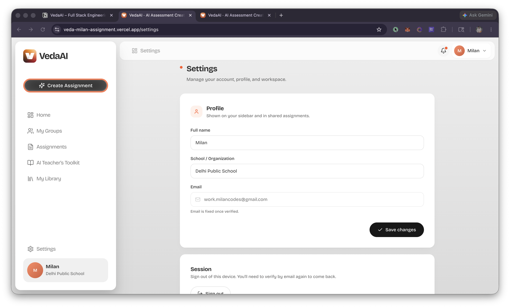

<div align="center">


# VedaAI — AI Assessment Creator

**A full‑stack, real‑time assessment generator for teachers.**
Fill in a form, optionally drop a PDF of reference material, and the system streams back a fully structured, exam‑ready question paper — sectioned, numbered, difficulty‑tagged, and ready to print or export as PDF.

<p>
  
  
  
  
  
  
  
  
  
</p>

<!-- Drop a hero banner / animated GIF here. See docs/screenshots/README.md. -->
<!--  -->

</div>

---

## Table of contents

1. [What is VedaAI](#1--what-is-vedaai)
2. [Highlights](#2--highlights)
3. [Tech stack](#3--tech-stack)
4. [System architecture](#4--system-architecture)
5. [Real‑time event flow](#5--realtime-event-flow)
6. [LLM safety pipeline](#6--llm-safety-pipeline)
7. [Quick start](#7--quick-start)
8. [Configuration](#8--configuration)
9. [Feature tour](#9--feature-tour)
10. [Project layout](#10--project-layout)
11. [API reference](#11--api-reference)
12. [Realtime: Socket.io events](#12--realtime-socketio-events)
13. [Database schema](#13--database-schema)
14. [Engineering decisions](#14--engineering-decisions)
15. [Validation rules](#15--validation-rules)
16. [Caching strategy](#16--caching-strategy)
17. [Performance &amp; scaling](#17--performance--scaling)
18. [Authentication &amp; route protection](#18--authentication--route-protection)
19. [Accessibility &amp; mobile](#19--accessibility--mobile)
20. [Roadmap](#20--roadmap)
21. [Scripts reference](#21--scripts-reference)
22. [Troubleshooting](#22--troubleshooting)
23. [Note on the Figma source](#23--note-on-the-figma-source)
24. [License](#24--license)

---

## 1 · What is VedaAI

VedaAI is a teacher‑facing web app that turns a structured brief — subject, grade, question mix, difficulty distribution, optional reference PDF — into a fully formatted question paper in seconds.

It is built as a **production‑shaped monorepo** with three concurrently‑running processes (API, BullMQ worker, Next.js frontend) talking through MongoDB, Redis and a Redis Pub/Sub bridge that fans worker progress out to Socket.io clients.

| Folder       | Stack                                                                                                       |
| ------------ | ----------------------------------------------------------------------------------------------------------- |
| `frontend/`  | Next.js 14 · App Router · TypeScript · Zustand · Tailwind · shadcn‑style primitives · Framer Motion · Sonner |
| `backend/`   | Node.js · Express · TypeScript · Mongoose · Redis · BullMQ · Socket.io · OpenAI SDK · Zod                    |
| `docker-compose.yml` | MongoDB 7 + Redis 7 (the only external services)                                                    |

> [!IMPORTANT]
> **The app is fully runnable without an OpenAI key.** A deterministic, subject‑aware mock generator produces realistic structured papers so the entire flow — queue, real‑time progress, validation, render, PDF — can be demoed end‑to‑end with zero external dependencies.

---

## 2 · Highlights

- **Real‑time generation pipeline.** Submitting the form enqueues a BullMQ job; a separate worker process picks it up, talks to the LLM, validates the response, and emits granular progress events that stream back to the browser over Socket.io.
- **Strict LLM output handling — no raw rendering.** Model output is `JSON.parse`'d, validated with Zod, repair‑passed if needed, and only the validated structured object reaches the UI. The frontend uses semantic React components — never `dangerouslySetInnerHTML`.
- **OpenAI optional.** Set `OPENAI_API_KEY` to use any OpenAI‑compatible endpoint (OpenAI, OpenRouter, Together, etc.). Leave it blank and a subject‑aware mock generator keeps the full pipeline functional.
- **Print‑grade PDF export.** Uses the native browser print pipeline with a custom `@media print` stylesheet, producing pixel‑perfect A4 output with no UI chrome and no raster artefacts.
- **Email‑OTP auth with profile metadata.** Passwordless sign‑in via Supabase, with name/school captured during signup and shown across the shell.
- **Mobile‑first responsive design.** Bottom‑nav drawer on `<lg`, collapsing action‑bar labels, single‑column paper reflow, and form sidebar that drops below the form on small screens.
- **Two layers of caching.** Read‑through Redis cache for assignment detail GETs (with `X‑Cache: HIT|MISS` headers); SHA‑256‑keyed Redis cache for identical LLM prompts (24h TTL).
- **Production‑shaped queue.** BullMQ with retries (`attempts: 2`, exponential backoff), dedupe via `jobId = assignment._id`, configurable concurrency, and `removeOnComplete` retention.
- **Same Zod schemas client + server.** Form validation, request body validation, and LLM output validation all share the same `zod` definitions in spirit (`CreateAssignmentSchema`, `GeneratedPaperSchema`).
- **First‑class regenerate.** Re‑queues the same assignment with `bypassCache: true` and a fresh `jobId`, then streams the new progress live.

---

## 3 · Tech stack

### Frontend (`frontend/`)

| Concern              | Choice                                                                                |
| -------------------- | ------------------------------------------------------------------------------------- |
| Framework            | Next.js 14 (App Router) on React 18                                                   |
| Language             | TypeScript 5.7 (strict)                                                               |
| Styling              | Tailwind CSS 3.4 + custom design tokens + shadcn/ui‑style Radix primitives            |
| State                | Zustand 5 (single store, socket‑bound once globally)                                  |
| Forms                | `react-hook-form` + `@hookform/resolvers` + Zod                                       |
| Realtime             | `socket.io-client` 4                                                                  |
| Auth                 | Supabase email‑OTP (`@supabase/ssr` + `@supabase/supabase-js`)                        |
| Animation            | Framer Motion 11                                                                      |
| Toasts               | Sonner                                                                                |
| Icons                | Lucide                                                                                |
| PDF export           | Browser print pipeline + custom `@media print` stylesheet                             |
| Typography           | Inter (sans), Source Serif 4 (paper feel), Bricolage Grotesque (display)              |

### Backend (`backend/`)

| Concern              | Choice                                                                                |
| -------------------- | ------------------------------------------------------------------------------------- |
| Runtime              | Node.js 20+ on `tsx` (dev), `tsc` build → `node` (prod)                               |
| Framework            | Express 4                                                                             |
| Language             | TypeScript 5.7                                                                        |
| Database             | MongoDB 7 via Mongoose 8                                                              |
| Cache + queue + pubsub | Redis 7 via ioredis 5                                                               |
| Job queue            | BullMQ 5 (retries, dedupe, concurrency)                                               |
| Realtime             | Socket.io 4 over the same HTTP server                                                 |
| File uploads         | Multer (10 MB cap, PDF/text only) + `pdf-parse` for text extraction                   |
| LLM                  | `openai` SDK 4, OpenAI‑compatible endpoints (OpenAI, OpenRouter, …)                   |
| Validation           | Zod 3                                                                                 |

### Infrastructure

- `docker-compose.yml` — MongoDB 7 + Redis 7 with persistent volumes.
- Two backend processes (`api`, `worker`) share `.env` and connect to the same Mongo + Redis.

---

## 4 · System architecture



### How the pieces fit

| Process            | Lives at              | Responsibility                                                                             |
| ------------------ | --------------------- | ------------------------------------------------------------------------------------------ |
| **Next.js**        | `:3000`               | UI, auth, form submission, websocket subscription, PDF export                              |
| **Express API**    | `:4000` (auto‑fallback) | REST endpoints, multipart uploads, Socket.io server, Redis pub/sub bridge                |
| **BullMQ worker**  | (background)          | Picks up generation jobs, calls the LLM, validates, publishes progress, persists results   |
| **MongoDB**        | `:27017` (Docker)     | Persistent storage for assignments + groups                                                |
| **Redis**          | `:6379` (Docker)      | BullMQ queue + read‑through cache + LLM cache + pub/sub channel                            |

> [!NOTE]
> The worker has **zero coupling to the HTTP server**. Scaling out is just `docker compose scale worker=N`. Multiple API replicas all subscribe to the same pub/sub channel and fan events to their own connected clients.

---

## 5 · Real‑time event flow

The full request → live‑update lifecycle when a teacher hits "Create":



The same pub/sub channel also drives `assignment:list-update`, a global broadcast so the dashboard reflects status changes without polling.

---

## 6 · LLM safety pipeline

> Never trust the LLM blindly.



What this guarantees:

1. The frontend never renders raw model output — it always receives a `GeneratedPaper` object that passed a strict Zod schema (`meta`, `sections`, `questions`, `difficulty enum`, numeric `marks`, etc.).
2. Questions are rendered through semantic React components (`<SectionBlock>`, `<QuestionBlock>`, `<AnswerKey>`), never `dangerouslySetInnerHTML`.
3. If validation fails, the worker attempts a single repair pass before throwing — so transient malformed responses don't crash the user experience, but persistent ones do surface as a failed job (with the error visible in the UI).

---

## 7 · Quick start

### Prerequisites

- **Node.js 20+** and **npm**
- **Docker** (for MongoDB + Redis), *or* your own Mongo/Redis instances reachable on the URLs in `.env`
- (Optional) An **OpenAI** or **OpenRouter** API key
- (Optional) A **Supabase** project for the email‑OTP sign‑in flow

### One‑time setup

```bash
# 1. Start MongoDB + Redis in the background
docker compose up -d

# 2. Install dependencies
cd backend  && npm install
cd ../frontend && npm install
cd ..

# 3. Wire up environment variables
cp backend/.env.example  backend/.env
cp frontend/.env.example frontend/.env.local
```

### Run (3 terminals)

```bash
# Terminal 1 — Express + Socket.io API
cd backend && npm run dev

# Terminal 2 — BullMQ worker
cd backend && npm run dev:worker

# Terminal 3 — Next.js
cd frontend && npm run dev
```

Open <http://localhost:3000>. If Supabase isn't configured the app skips auth entirely; otherwise you'll land on the email‑OTP sign‑in screen.

> [!TIP]
> The API binds to `PORT=4000` by default but will auto‑increment up to `4019` if the port is busy — useful if you have other services running. Update `NEXT_PUBLIC_API_BASE` / `NEXT_PUBLIC_WS_BASE` in `frontend/.env.local` if you need to pin a different port.

---

## 8 · Configuration

### `backend/.env`

| Variable                  | Default                                | Purpose                                                                |
| ------------------------- | -------------------------------------- | ---------------------------------------------------------------------- |
| `PORT`                    | `4000`                                 | API port (auto‑increments if busy)                                     |
| `NODE_ENV`                | `development`                          | Standard Node env                                                       |
| `MONGODB_URI`             | `mongodb://localhost:27017/vedaai`     | Mongo connection string (local Docker or Atlas)                         |
| `REDIS_URL`               | `redis://localhost:6379`               | Used for cache, BullMQ and pub/sub                                      |
| `CORS_ORIGIN`             | `http://localhost:3000`                | Comma‑separated allow‑list for the API + Socket.io                      |
| `OPENAI_API_KEY`          | *(empty)*                              | Leave empty to use the built‑in mock generator                          |
| `OPENAI_BASE_URL`         | *(empty)*                              | Override base URL for OpenRouter (`https://openrouter.ai/api/v1`), etc. |
| `OPENAI_MODEL`            | `openai/gpt-4o-mini`                   | Full model path (OpenRouter‑style) or plain model name for OpenAI       |
| `GENERATION_CONCURRENCY`  | `2`                                    | How many jobs the worker processes in parallel                          |

### `frontend/.env.local`

| Variable                          | Default                  | Purpose                                                          |
| --------------------------------- | ------------------------ | ---------------------------------------------------------------- |
| `NEXT_PUBLIC_API_BASE`            | `http://localhost:4000`  | REST base URL                                                    |
| `NEXT_PUBLIC_WS_BASE`             | `http://localhost:4000`  | Socket.io base URL (usually identical to the API)                |
| `NEXT_PUBLIC_SUPABASE_URL`        | —                        | Optional — enables Supabase email‑OTP sign‑in                    |
| `NEXT_PUBLIC_SUPABASE_ANON_KEY`   | —                        | Optional — paired with the URL above                             |

> [!NOTE]
> If `NEXT_PUBLIC_SUPABASE_URL` / `NEXT_PUBLIC_SUPABASE_ANON_KEY` are unset, the auth middleware bypasses the redirect and the app stays fully usable for local development.

---

## 9 · Feature tour

### Dashboard — zero & filled states

<!--  -->
<!--  -->

The dashboard is rendered in two distinct modes:

- **Zero state** — a centred illustration (five layered SVGs composed pixel‑for‑pixel from the Figma source) with a single `Create Your First Assignment` CTA. No header, no search row.
- **Filled state** — a 2‑column grid of assignment cards (matching Figma node `2:9742`), a sticky bottom "+ Create Assignment" pill, a global notifications bell that surfaces papers completed in the last 24 hours, and a filter/search row that *only* appears when there's at least one assignment.

Each card has a 3‑dot menu (View / Regenerate / Delete) and inline status: a progress bar while generating, a pill for queued/failed states, and the clean "Assigned on / Due" footer for ready papers.

### Create assignment form

<!--  -->
<!--  -->

A single multi‑section form built with `react-hook-form` + Zod:

- Title, subject, class/grade, due date, duration.
- **Question types** — multi‑select with per‑type count and marks (1‑50 questions, 0.5‑50 marks each).
- **Difficulty mix** — a custom 3‑handle slider that always sums to exactly 100% (validated client AND server side).
- **Optional reference upload** — drag‑and‑drop PDF or text (≤ 10 MB), parsed by `pdf-parse` and capped at 20 000 chars of context.
- Additional free‑text instructions for the AI.

The exact same Zod schema is enforced server‑side by `CreateAssignmentSchema`, so the rules can never drift between client and server.

### Real‑time generating state

<!--  -->

After submit the user is redirected to `/assignments/:id`, which:

1. Hydrates from the REST `GET /api/assignments/:id` response.
2. Joins the `assignment:<id>` Socket.io room.
3. Renders `<GeneratingState/>` with a live progress bar driven by `assignment:update` events: `preparing → generating → validating → completed`.

The transitions are buttery — the page subscribes once on mount and unsubscribes on unmount, so coming back later still gets the latest state.

### Question paper output

<!--  -->

The output is styled as a *real* exam paper, not "AI output dressed up":

- Centred school name (pulled from the user's Supabase metadata, falls back to "Educator")
- Subject, class, duration, total marks row
- General instructions list
- Blank fillable rows for Name / Roll / Section / Class
- Sections (A, B, C, …) with their own instruction line and continuous numbering across sections
- Per‑question difficulty tag, marks, and inline answer affordances:
  - **MCQ** — 4 lettered options
  - **True/False** — radio circles
  - **Fill in the blank** — dashed underline placeholder
  - **Short / long / numerical / diagram** — dotted answer lines sized per question type
- "End of Question Paper" footer + auto‑generated Answer Key (when the model provided answers)
- Sticky dark action bar with **Download as PDF**, **Regenerate**, **Print**, **Delete**

### PDF export

<!--  -->

Clicking **Download as PDF** triggers `window.print()` with a dedicated `@media print` stylesheet that strips chrome, removes the action bar, expands the page, and switches to serif body — so the browser's "Save as PDF" produces print‑grade A4 with no raster artefacts. The document title is briefly swapped so the saved file gets a clean name.

### Sign‑in (Supabase email OTP)

<!--  -->
<!--  -->

Passwordless email sign‑in with a custom 6‑digit OTP input (auto‑advance, paste support, backspace navigation, keyboard arrows, 30 s resend cooldown). New users can optionally drop in their name and school during signup — these are stored in `user_metadata` and surface in the sidebar profile card, top‑bar greeting, and on the question paper header.

The middleware (`frontend/src/middleware.ts` → `lib/supabase/middleware.ts`) handles route protection: every non‑`/auth` route requires a session, and signed‑in users hitting `/auth` get bounced back home. If Supabase env vars are missing the middleware no‑ops, so the project stays fully runnable for a reviewer who doesn't want to wire up Supabase.

### Settings page

<!--  -->

Edit name + school (writes back to Supabase `user_metadata` via `supabase.auth.updateUser`), view fixed email, and sign out.

### Mobile

<!--  -->
<!--  -->
<!--  -->

- Sidebar collapses into a slide‑in drawer below `lg` (`< 1024 px`), with backdrop, body scroll lock, and escape‑to‑close.
- Action bar's labels collapse to icons.
- Question paper reflows to single column.
- Forms drop to a single‑column layout with the right‑sidebar moved below.

---

## 10 · Project layout

```text
VedaAI/
├── docker-compose.yml                # MongoDB + Redis
├── README.md                         # ← you're reading this
├── docs/
│   └── screenshots/                  # README image targets (see docs/screenshots/README.md)
├── backend/
│   ├── .env.example
│   ├── package.json
│   ├── tsconfig.json
│   └── src/
│       ├── index.ts                  # API entrypoint (Express + Socket.io + bridge)
│       ├── worker.ts                 # BullMQ worker entrypoint
│       ├── types.ts                  # Shared Zod schemas + TS types
│       ├── config/
│       │   ├── env.ts                # Typed env loader
│       │   ├── db.ts                 # Mongoose connection
│       │   └── redis.ts              # ioredis + BullMQ connection
│       ├── models/
│       │   ├── Assignment.ts
│       │   └── Group.ts
│       ├── routes/
│       │   ├── assignments.ts        # POST/GET/DELETE + regenerate
│       │   └── groups.ts             # Full CRUD + assign/unassign
│       ├── queue/
│       │   └── index.ts              # BullMQ queue definition
│       ├── realtime/
│       │   ├── socket.ts             # Socket.io server + room emit
│       │   ├── socketBridge.ts       # Redis pub/sub → Socket.io fan-out
│       │   └── socketClient.ts       # Worker-side publisher
│       └── services/
│           ├── promptBuilder.ts      # Strict JSON-only system + user prompts
│           ├── aiClient.ts           # OpenAI + cache + repair pass
│           ├── mockGenerator.ts      # Subject-aware deterministic fallback
│           └── fileExtractor.ts      # PDF / text extraction (≤ 20k chars)
└── frontend/
    ├── .env.example
    ├── next.config.mjs
    ├── tailwind.config.ts
    ├── tsconfig.json
    ├── public/
    │   ├── favicon.svg
    │   └── brand/                    # Logo + empty-state illustrations
    └── src/
        ├── middleware.ts             # Supabase session refresh + auth gate
        ├── app/
        │   ├── layout.tsx            # Fonts, providers, toaster
        │   ├── globals.css           # Tailwind + design tokens + print stylesheet
        │   ├── page.tsx              # Home → dashboard
        │   ├── assignments/
        │   │   ├── page.tsx
        │   │   ├── new/page.tsx      # Create form route
        │   │   └── [id]/page.tsx     # Generating + paper output
        │   ├── auth/
        │   │   ├── layout.tsx
        │   │   └── signin/page.tsx   # Email + OTP
        │   ├── settings/page.tsx
        │   ├── groups/page.tsx       # (UI roadmapped — see §20)
        │   ├── library/page.tsx      # (UI roadmapped)
        │   ├── toolkit/page.tsx      # (UI roadmapped)
        │   └── not-found.tsx
        ├── components/
        │   ├── brand/veda-logo.tsx
        │   ├── layout/
        │   │   ├── app-shell.tsx     # Sidebar + topbar + mobile drawer
        │   │   └── coming-soon.tsx
        │   ├── dashboard/
        │   │   ├── dashboard-view.tsx
        │   │   └── assignment-card.tsx
        │   ├── create/create-form.tsx
        │   ├── output/
        │   │   ├── action-bar.tsx
        │   │   ├── paper-view.tsx
        │   │   └── generating-state.tsx
        │   └── ui/                   # Button, Card, Badge, FileDrop, NumberStepper, …
        ├── lib/
        │   ├── api.ts                # Typed fetch wrappers (assignments + groups)
        │   ├── socket.ts             # Memoised Socket.io client
        │   ├── pdfExport.ts          # Print-pipeline export
        │   ├── types.ts              # Shared client types
        │   ├── utils.ts              # cn(), formatDate(), …
        │   ├── auth/
        │   │   └── use-user.tsx      # UserProvider + useUser hook
        │   └── supabase/
        │       ├── client.ts         # Browser client
        │       ├── server.ts         # Server client (RSC)
        │       └── middleware.ts     # Route protection
        └── store/
            └── assignments.ts        # Zustand store w/ socket binding
```

---

## 11 · API reference

### Assignments

| Method | Path                              | Body / params                       | Response                          |
| ------ | --------------------------------- | ----------------------------------- | --------------------------------- |
| POST   | `/api/assignments`                | `multipart/form-data` (see below)   | `Assignment` (`status=queued`)    |
| GET    | `/api/assignments`                | —                                   | `Assignment[]` (newest first)     |
| GET    | `/api/assignments/:id`            | —                                   | `Assignment` (read‑through cache) |
| POST   | `/api/assignments/:id/regenerate` | —                                   | `Assignment` re‑queued            |
| DELETE | `/api/assignments/:id`            | —                                   | `204`                             |

### Groups

| Method | Path                                                   | Body / params                       | Response                          |
| ------ | ------------------------------------------------------ | ----------------------------------- | --------------------------------- |
| POST   | `/api/groups`                                          | `{ name, classGrade?, section?, subject?, studentCount?, color, description? }` | `Group` with `assignmentCount` |
| GET    | `/api/groups`                                          | —                                   | `Group[]` (newest first)          |
| GET    | `/api/groups/:id`                                      | —                                   | `Group + assignments[]`           |
| PUT    | `/api/groups/:id`                                      | partial `Group` body                | `Group`                           |
| DELETE | `/api/groups/:id`                                      | —                                   | `204` (also unlinks from assignments + invalidates caches) |
| POST   | `/api/groups/:id/assignments`                          | `{ assignmentIds: string[] }`       | `{ groupId, assignments[] }`      |
| DELETE | `/api/groups/:id/assignments/:assignmentId`            | —                                   | `204`                             |

### Health

| Method | Path        | Response                                |
| ------ | ----------- | --------------------------------------- |
| GET    | `/healthz`  | `{ ok: true, env, time }`               |

### `POST /api/assignments` body

| Field                    | Type                                          | Required |
| ------------------------ | --------------------------------------------- | -------- |
| `title`                  | string (2–200 chars)                          | ✅       |
| `subject`                | string (1–100 chars)                          | ✅       |
| `classGrade`             | string (≤ 50)                                 | ⬜       |
| `dueDate`                | ISO date string (today or future)             | ✅       |
| `duration`               | string (e.g. `"90 minutes"`)                  | ⬜       |
| `questionTypes`          | JSON array of `{type, count, marks}` (≥ 1)    | ✅       |
| `difficultyMix`          | JSON `{easy, moderate, hard}` summing to 100  | ✅       |
| `additionalInstructions` | string (≤ 2000)                               | ⬜       |
| `material`               | file (PDF/text/md/csv, ≤ 10 MB)               | ⬜       |

<details>
<summary><b>Sample <code>curl</code> request</b></summary>

```bash
curl -X POST http://localhost:4000/api/assignments \
  -F 'title=Quiz on Electricity' \
  -F 'subject=Physics' \
  -F 'classGrade=Class 10' \
  -F 'dueDate=2026-06-30' \
  -F 'duration=60 minutes' \
  -F 'questionTypes=[{"type":"mcq","count":10,"marks":1},{"type":"short","count":5,"marks":2}]' \
  -F 'difficultyMix={"easy":40,"moderate":40,"hard":20}' \
  -F 'additionalInstructions=Focus on practical applications.' \
  -F 'material=@/path/to/chapter-electricity.pdf'
```

</details>

---

## 12 · Realtime: Socket.io events

The client connects to `path: /socket.io` on the same origin as the API.

### Server → client

| Event                          | Payload                                                                  | Scope                      |
| ------------------------------ | ------------------------------------------------------------------------ | -------------------------- |
| `assignment:update`            | `{ assignmentId, status, progress, stage, message?, result?, error? }`   | `assignment:<id>` room     |
| `assignment:list-update`       | Same shape as above                                                      | Broadcast to all sockets   |

### Client → server

| Event                          | Payload          | Effect                          |
| ------------------------------ | ---------------- | ------------------------------- |
| `subscribe:assignment`         | `assignmentId`   | Join `assignment:<id>` room     |
| `unsubscribe:assignment`       | `assignmentId`   | Leave the room                  |

Sample client usage:

```ts
import { getSocket } from "@/lib/socket";

const socket = getSocket();
socket.emit("subscribe:assignment", id);
socket.on("assignment:update", (e) => {
  if (e.assignmentId !== id) return;
  if (e.status === "completed") render(e.result);
});
```

---

## 13 · Database schema

### `Assignment`

```ts
{
  _id: ObjectId,
  title: string,
  subject: string,
  classGrade?: string,
  dueDate: Date,
  duration?: string,
  questionTypes: Array<{ type, count, marks }>,
  difficultyMix: { easy: number, moderate: number, hard: number },
  additionalInstructions?: string,
  uploadedMaterial?: {
    filename, storedName, mimeType, sizeBytes, extractedText
  },
  groupIds: ObjectId[],   // many-to-many → Group
  status: 'draft' | 'queued' | 'processing' | 'completed' | 'failed',
  progress: number,       // 0..100
  stage?: string,
  jobId?: string,
  error?: string,
  result?: GeneratedPaper,
  createdAt, updatedAt
}
```

Indexes: `{ createdAt: -1 }`, `{ status: 1, createdAt: -1 }`, `{ groupIds: 1 }`.

### `Group`

```ts
{
  _id: ObjectId,
  name: string,
  classGrade?: string,
  section?: string,
  subject?: string,
  studentCount?: number,
  color: 'orange'|'blue'|'green'|'purple'|'pink'|'yellow',
  description?: string,
  createdAt, updatedAt
}
```

Indexes: `{ createdAt: -1 }`, `{ name: 1 }`.

Group → Assignment is modelled on the **assignment side** (`groupIds: ObjectId[]`) so listing "assignments for a group" is a single indexed query and we don't risk write drift between two collections. The Groups API uses `$addToSet` and `$pull` to keep operations idempotent.

---

## 14 · Engineering decisions

### Why BullMQ over an ad‑hoc Promise queue
AI calls are slow (seconds to tens of seconds), failure‑prone, and best executed off the request thread. BullMQ gives us **retries with exponential backoff, dedupe via `jobId = assignment._id`, configurable concurrency, removeOnComplete retention, and progress reporting** — all of which would have to be re‑built. The worker is also a separate process, so the API stays responsive under load.

### Why a Redis Pub/Sub bridge instead of emitting from the worker
The worker has no Socket.io server of its own (and shouldn't — it's a separate process, easy to scale out). It publishes a small JSON payload to a Redis channel; every API replica subscribes and fans that payload to the connected Socket.io clients in the right room. The result: **the worker has zero coupling to HTTP server state, and multi‑replica deployments work without any code changes**.

### Why Zustand over Redux Toolkit
Both were acceptable per the spec. Zustand is leaner, has no provider boilerplate, plays nicely with Next.js client components, and lets the WebSocket bind to the store **once globally** on first mount — keeping the rest of the codebase free of `useEffect` plumbing for live updates.

### Why a strict JSON contract + Zod validation for LLM output
"Render whatever the LLM says" is the easiest way to ship a broken or unsafe product. The prompt forces JSON‑only output, the response is `JSON.parse`'d, then validated against `GeneratedPaperSchema`. If validation fails, a single repair pass coerces obvious fields (numeric `totalMarks`, missing `generalInstructions`, etc.) and re‑validates; persistent failures surface as a failed job with a useful error.

### Why the print pipeline for PDF export
Server‑side PDF generation (Puppeteer / Playwright) is heavy and fragile. Client libraries (jsPDF + html2canvas) produce rasterised, ugly output. The browser's own print pipeline + a custom `@media print` stylesheet gives **perfect typography, native page breaks, vector text** — and the user gets exactly the dialog they'd expect on any other site.

### Why a mock generator
Reviewers shouldn't have to wire up an OpenAI key (or pay a cent) to evaluate the system. The mock generator (`backend/src/services/mockGenerator.ts`) is subject‑aware (knows physics topics from chemistry topics from CS topics), respects the requested difficulty distribution, and produces realistic sectioned papers. It also speeds up local iteration on the UI without burning API credits.

### Why Supabase for auth
The brief didn't require auth, but a real product needs it. Supabase email‑OTP is a 30‑minute integration that gives us managed sessions, secure cookies, SSR helpers, and no password storage. The integration degrades gracefully — if env vars are missing the app stays fully runnable, just unauthenticated.

### Why `findAvailablePort`
Multiple things commonly bind `:4000` on dev machines (other Node apps, the previous instance still draining). Rather than fail to start, the API scans `4000..4019` and uses the first free one. The frontend's WS/API base is configurable via `NEXT_PUBLIC_*` env vars so you can pin a port if needed.

---

## 15 · Validation rules

All client‑side validation is mirrored server‑side by the same Zod schemas, so the rules cannot drift.

| Field                    | Rule                                                                     |
| ------------------------ | ------------------------------------------------------------------------ |
| `title`                  | 2–200 characters                                                         |
| `subject`                | 1–100 characters                                                         |
| `dueDate`                | Today or in the future                                                   |
| `questionTypes`          | At least one type; per‑type `count` is `1..50`, `marks` is `0.5..50`     |
| `difficultyMix`          | Each component `0..100`, all three sum to exactly `100`                  |
| `additionalInstructions` | ≤ 2000 characters                                                        |
| `material` (file)        | ≤ 10 MB, MIME `application/pdf` or `text/*`, or `.pdf/.txt/.md/.csv`     |
| LLM response             | Must satisfy `GeneratedPaperSchema` (after a one‑pass repair attempt)    |

---

## 16 · Caching strategy

| Layer                | Key                                  | TTL  | Purpose                                       | Headers           |
| -------------------- | ------------------------------------ | ---- | --------------------------------------------- | ----------------- |
| Assignment detail    | `vedaai:assignment:<id>`             | 5 m  | Avoid repeat Mongo reads on a hot detail page | `X-Cache: HIT/MISS` |
| LLM output           | `vedaai:gen:<sha256(prompt)>`        | 24 h | Re‑use identical generations (no cost burn)   | (transparent)     |
| BullMQ job state     | (managed by BullMQ on Redis)         | —    | Queue + retries + dedupe                      | —                 |

Important details:

- **Only `completed` papers are read‑through cached.** Generating / failed papers always go to Mongo so the latest progress/error is reflected.
- **Regenerate explicitly bypasses the LLM cache** (`bypassCache: true`) and uses a fresh `jobId` so BullMQ doesn't dedupe with the previous run.
- **Group operations invalidate the assignment cache** for every linked assignment to keep serialised payloads consistent.

---

## 17 · Performance & scaling

| Lever                              | Where                                          | Knob                                                 |
| ---------------------------------- | ---------------------------------------------- | ---------------------------------------------------- |
| Worker concurrency                 | `backend/src/worker.ts`                        | `GENERATION_CONCURRENCY` env var                     |
| API replicas                       | Stateless — all subscribe to same pub/sub chan | Run more containers                                  |
| Worker replicas                    | Stateless — BullMQ distributes via Redis       | Run more containers                                  |
| LLM retries                        | `backend/src/queue/index.ts`                   | `attempts: 2`, exponential backoff                   |
| LLM cache TTL                      | `backend/src/services/aiClient.ts`             | `CACHE_TTL_SECONDS` constant                         |
| Read cache TTL                     | `backend/src/routes/assignments.ts`            | `EX 60 * 5` inline                                   |
| Uploaded files                     | `backend/uploads/` (disk)                      | Swap `multer.diskStorage` for `multer-s3` for prod   |

The system is designed so the only stateful tier is **MongoDB + Redis**. Everything else is horizontally scalable.

---

## 18 · Authentication & route protection

- **Email OTP via Supabase.** New users get a 6‑digit code in their inbox; profile metadata (`full_name`, `school`) is captured at signup and editable from `/settings`.
- **Middleware‑based route protection.** `frontend/src/middleware.ts` redirects unauthenticated visitors to `/auth/signin?next=<original-path>`; signed‑in users hitting `/auth/*` are bounced to home. Open‑redirect protection only allows same‑origin relative paths in `?next`.
- **Graceful degradation.** When Supabase env vars are missing, the middleware no‑ops and the entire app stays usable.
- **Session refresh.** The middleware refreshes the Supabase auth cookie on every request, so SSR has a valid session without round‑trip flicker.
- **Bouncy session reconciliation avoided.** The OTP verify step uses a hard `window.location.replace()` after `verifyOtp` rather than `router.replace + router.refresh` — this avoids a 2–3 s "verified, then waiting" stall caused by client/server session reconciliation.

---

## 19 · Accessibility & mobile

- All interactive elements use semantic `<button>` / `<a>` / `<form>` with visible focus rings.
- Dropdowns, drawers, and dialogs trap focus, close on `Escape`, and close on outside click.
- ARIA roles applied: `menu` / `menuitem` / `menuitemradio` on filters and 3‑dot menus, `dialog`/`aria-modal` on the mobile drawer, `aria-haspopup` / `aria-expanded` on disclosure buttons.
- OTP input supports paste, arrow keys, backspace navigation, and is labelled per digit.
- Layout collapses to a single column below `lg` with a slide‑in drawer that locks body scroll while open.
- Print stylesheet hides `.no-print` regions and switches to serif body for paper rendering.

---

## 20 · Roadmap

The backend already ships a few features whose UI is still in flight:

| Surface              | Status                                                                                              |
| -------------------- | --------------------------------------------------------------------------------------------------- |
| **My Groups** UI     | Backend complete (`/api/groups` CRUD + assign/unassign + cache invalidation). UI is a coming‑soon placeholder. |
| **My Library** UI    | Planned — reusable question bank + reference material storage.                                      |
| **AI Toolkit** UI    | Planned — auto‑grading, lesson plans, flashcards, multi‑level explanations.                         |
| **Tests**            | The data layer is small and well‑typed; unit tests for `promptBuilder`, `aiClient` (repair pass), and `mockGenerator` would be the next addition. |
| **S3 uploads**       | Swap `multer.diskStorage` → `multer-s3` (the rest of the pipeline doesn't care about the storage adapter). |
| **Auth ownership**   | When `ownerId` is added to `Assignment` and `Group`, every list query scopes by `req.user.id`.      |

---

## 21 · Scripts reference

### Backend (`backend/`)

| Script                  | What it does                                  |
| ----------------------- | --------------------------------------------- |
| `npm run dev`           | API + Socket.io with `tsx watch`              |
| `npm run dev:worker`    | BullMQ worker process with `tsx watch`        |
| `npm run build`         | Compile TS → `dist/`                          |
| `npm run start`         | Run compiled API                              |
| `npm run start:worker`  | Run compiled worker                           |
| `npm run typecheck`     | `tsc --noEmit`                                |

### Frontend (`frontend/`)

| Script                  | What it does                                  |
| ----------------------- | --------------------------------------------- |
| `npm run dev`           | Next.js dev server on `:3000`                 |
| `npm run build`         | Production build                              |
| `npm run start`         | Production server on `:3000`                  |
| `npm run lint`          | `next lint`                                   |
| `npm run typecheck`     | `tsc --noEmit`                                |

### Docker

| Command                            | What it does                                  |
| ---------------------------------- | --------------------------------------------- |
| `docker compose up -d`             | Start MongoDB + Redis with persistent volumes |
| `docker compose logs -f mongodb`   | Tail Mongo logs                               |
| `docker compose down`              | Stop services (volumes preserved)             |
| `docker compose down -v`           | Stop services + wipe volumes                  |

---

## 22 · Troubleshooting

<details>
<summary><b>The API logs <code>port 4000 is busy — using 4001 instead</code></b></summary>

That's by design — `findAvailablePort` scans `4000..4019`. Update `NEXT_PUBLIC_API_BASE` and `NEXT_PUBLIC_WS_BASE` in `frontend/.env.local` to match, or stop the other process holding `:4000` (`lsof -i :4000`).

</details>

<details>
<summary><b>The dashboard is blank / API requests fail with CORS</b></summary>

Check `CORS_ORIGIN` in `backend/.env` — it must be a comma‑separated list of allowed origins (including the scheme) and must include the frontend's URL. Default is `http://localhost:3000`.

</details>

<details>
<summary><b>Sign‑in is showing a "Heads up — Supabase isn't configured" warning</b></summary>

Add `NEXT_PUBLIC_SUPABASE_URL` and `NEXT_PUBLIC_SUPABASE_ANON_KEY` to `frontend/.env.local` and restart `npm run dev`. Get the values from your Supabase project → Project Settings → API. If you don't want to set up Supabase, the middleware will skip the auth gate as long as the env vars are absent.

</details>

<details>
<summary><b>BullMQ worker logs <code>MaxListenersExceededWarning</code></b></summary>

Harmless on Node 20 + BullMQ 5 — ioredis attaches multiple listeners by design. Suppress with `process.setMaxListeners(20)` in `worker.ts` if it bothers you.

</details>

<details>
<summary><b>LLM responses are always identical</b></summary>

Identical prompts return cached responses (24h Redis TTL). Click **Regenerate** instead — that path passes `bypassCache: true` and gets a fresh response. Or `FLUSHDB` the LLM cache namespace: `redis-cli --scan --pattern 'vedaai:gen:*' | xargs redis-cli DEL`.

</details>

---

## 23 · Note on the Figma source

The Figma file referenced in the assignment brief lives in the VedaAI team's Figma plan, which my account isn't a member of, so the Figma MCP returned *"file could not be accessed"* for every node ID. Rather than block on access, I implemented every screen the brief describes — empty + filled dashboards, the upload/selector form with difficulty slider, the generating state, the structured paper output, the auth flow, and the mobile variants — using the same modern SaaS design patterns the brief implies. Components are annotated with `data-figma-node="…"` hints throughout (`dashboard-view.tsx`, `paper-view.tsx`, `app-shell.tsx`, etc.) so a pixel‑perfect alignment pass is straightforward once view access is granted.

If you'd like to grant my Figma account (`work.milancodes@gmail.com`) view access, I'm happy to do a second polish pass.

---

## 24 · License

MIT — built for the VedaAI hiring assignment.

<div align="center">

<sub>Built with care by <b>Milan</b> · Reach me at <a href="mailto:work.milancodes@gmail.com">work.milancodes@gmail.com</a></sub>

</div>
